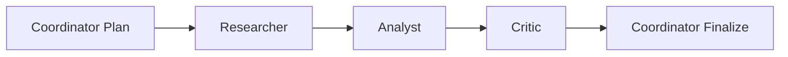
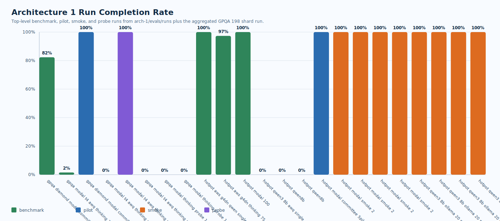
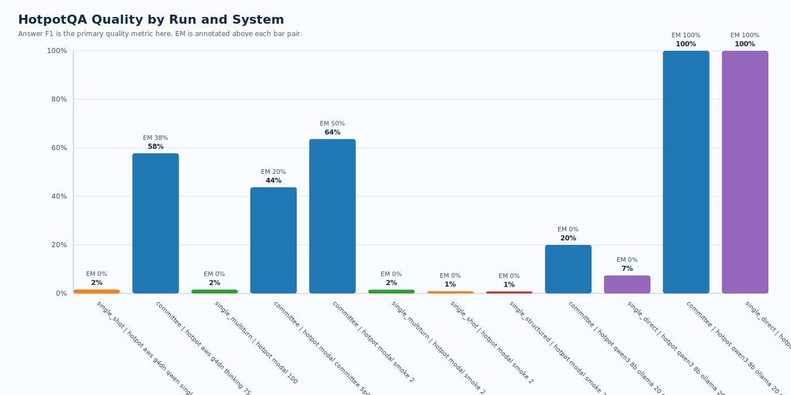
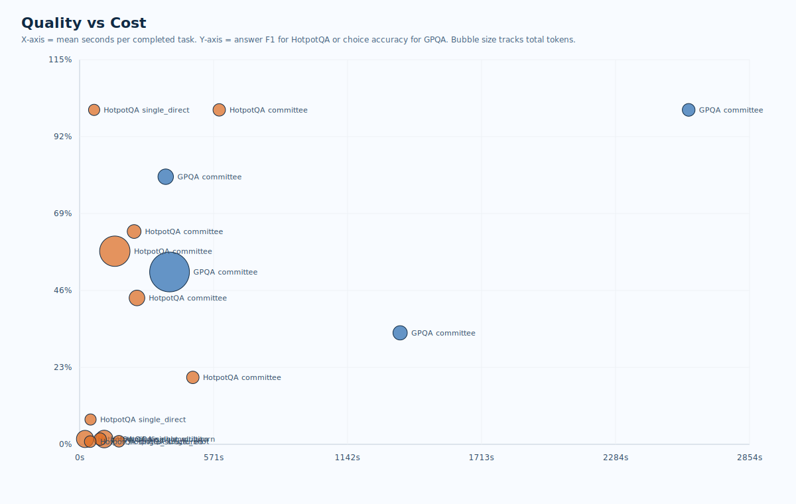
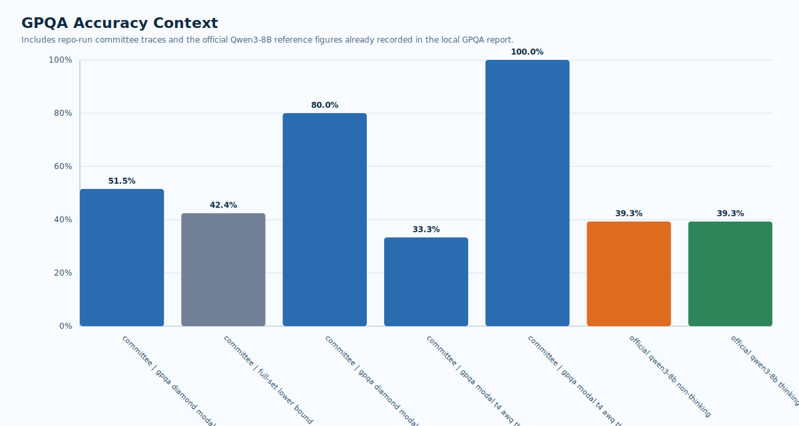
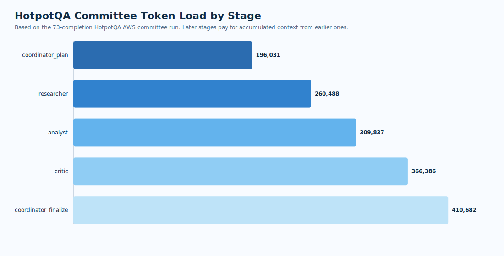

# Architecture 1 Benchmark Report

- Generated at (UTC): `2026-04-27T02:00:08+00:00`
- Source dataset: [`docs/generated/arch1_benchmark_report/arch1_benchmark_dataset.json`](arch1_benchmark_dataset.json)
- Scope: every top-level `arch-1/evals/runs/*/summary.json` benchmark artifact, plus the aggregated four-shard `gpqa_diamond_modal_committee_198_20260405` run.
- Important validity note: every checked-in runnable config used here is a `prompt_scaffold_only` configuration, so these are engineering benchmark results for the scaffold, not paper-valid role-specialist checkpoint results.

## Executive Summary

- Architecture 1 is implemented as a fixed five-call pipeline: `coordinator_plan -> researcher -> analyst -> critic -> coordinator_finalize`. The code enforces the stage order, per-role prompts, per-role schemas, and restricted local context views.
- On the strongest completed HotpotQA run in this repo, the `committee` scaffold on `Qwen/Qwen3-8B-AWQ` completed `73/75` tasks with `38.4%` EM and `57.7%` F1, versus the matched `single_shot` baseline at `0.0%` EM and `1.6%` F1.
- That HotpotQA quality gain was expensive: the committee used `1,543,424` total tokens and `150.0s` mean task latency, compared with `174,866` tokens and `23.1s` for the single-shot baseline.
- The full GPQA committee run on Modal partially worked, finishing `163/198` examples at `51.5%` completed-trace accuracy, but it was cut off mainly by `HTTP 429` billing-cap failures. The conservative full-set lower bound remained `42.4%`.
- Several checked-in runs are operational bring-up artifacts rather than meaningful benchmark outcomes: probe runs, smokes, and a 75-task AWQ single-shot attempt that failed `75/75` with `HTTP 404 invalid function call`.

## How Architecture 1 Works

- `coordinator_plan` sees only the task-facing fields and decomposes the problem before any answer is attempted.
- `researcher` adds evidence, options, assumptions, and open questions, but it still cannot see later-stage outputs.
- `analyst` converts the task plus researcher handoff into a draft answer.
- `critic` receives the draft and is explicitly tasked with finding unsupported jumps, missing evidence, and required revisions.
- `coordinator_finalize` receives the full upstream trail and produces the final answer after integrating critique.

Why it is wired this way:

- The fixed role order forces decomposition before synthesis, then inserts a dedicated adversarial check before finalization.
- Per-role schemas make each stage machine-checkable and keep later evaluation logic simple.
- Local context views keep role prompts narrow. Later stages inherit only the artifacts they need, which is why token cost grows by stage instead of exploding immediately.
- The architecture works by trading off latency and tokens for more structured reasoning pressure. The benchmark results here show that this can improve answer quality, especially on HotpotQA, but the cost increase is large.

## Graphs

## Key Findings

- HotpotQA matched-task comparison: committee won answer F1 on `68` of `73` matched completed tasks, single-shot won `4`, and `1` tied.
- The committee HotpotQA run kept `100%` supporting-fact context coverage while answer F1 rose to `57.7%`. Title precision and recall both fell to `60.4%`, which suggests the scaffold got more answers right without becoming equally precise at selecting evidence titles.
- The committee HotpotQA behavior metrics were strong: decomposition `87.7%`, evidence grounding `98.6%`, revision-after-critique `100.0%`, and premature finalization `0.0%`.
- Cost was the main downside. Relative to the 75-task HotpotQA single-shot baseline, the committee used about `8.8x` tokens and `6.5x` mean task latency.
- On GPQA, the aggregated full committee run beat the local report's official non-thinking Qwen3-8B reference (`39.3%`) on completed traces, but it remained below the official thinking reference (`62.0%`). Because `35` tasks did not complete, the more conservative figure for the full 198-task set is only `42.4%`.

## Operational Notes From Logs

- `hotpotqa_aws_g4dn_qwen_single_shot_75_20260414/benchmark.log` shows the 75-task AWS single-shot run completed end-to-end and checkpointed every task.
- `hotpotqa_aws_g4dn_qwen_single_shot_75_20260414/vllm.log` shows `Qwen/Qwen3-8B-AWQ` running on a T4-class setup with `vLLM 0.10.2`, `max_model_len=8192`, AWQ quantization, and typical generation throughput around the mid-20 tokens/s range once warmed.
- `hotpotqa_qwen3_8b_awq_single_shot_75_20260414/summary.json` shows a clean setup failure, not a bad model benchmark: `0/75` completed because every request failed with `HTTP 404: modal-http: invalid function call`.
- The aggregated GPQA shard run was mainly an infrastructure-budget failure. The local GPQA report records `30` billing-cap `HTTP 429` failures, `4` Modal `HTTP 500` terminations, and `1` `HTTP 400` context-window overflow.

## Complete Run Catalog

| Dataset | Category | Run | System | Model | Endpoint | Completed | Completion | Primary Quality | Mean sec/task | Tokens | Scaffold | Note |
| --- | --- | --- | --- | --- | --- | --- | --- | --- | --- | --- | --- | --- |
| GPQA | benchmark | gpqa_diamond_modal_committee_198_20260405 | committee | Qwen/Qwen3-8B | Modal | 163/198 | 82.3% | 51.5% | 383.2 | 3,361,018 | yes | partial completion; HTTP 400 context overflow=1, HTTP 429 billing cap=30, HTTP 500 internal termination=4 |
| GPQA | benchmark | gpqa_modal_t4_awq_thinking_198_20260405 | committee | Qwen/Qwen3-8B-AWQ | Modal | 3/198 | 1.5% | 33.3% | 1365.5 | 53,509 | yes | partial completion |
| GPQA | pilot | gpqa_diamond_modal_committee_5pilot_20260403 | committee | Qwen/Qwen3-8B | Modal | 5/5 | 100.0% | 80.0% | 366.7 | 95,942 | yes | completed |
| GPQA | probe | gpqa_modal_t4_awq_thinking_probe_1 | committee | Qwen/Qwen3-8B-AWQ | Modal | 0/1 | 0.0% | N/A | N/A | N/A | yes | no successful traces |
| GPQA | probe | gpqa_modal_t4_awq_thinking_probe_1_tuned | committee | Qwen/Qwen3-8B-AWQ | Modal | 1/1 | 100.0% | 100.0% | 2594.9 | 18,370 | yes | completed |
| GPQA | probe | gpqa_modal_t4_awq_thinking_probe_1_warm | committee | Qwen/Qwen3-8B-AWQ | Modal | 0/1 | 0.0% | N/A | N/A | N/A | yes | no successful traces |
| GPQA | probe | gpqa_modal_thinking_probe_1 | committee | Qwen/Qwen3-8B | Modal | 0/1 | 0.0% | N/A | N/A | N/A | yes | no successful traces |
| GPQA | probe | gpqa_modal_thinking_probe_1_escalated | committee | Qwen/Qwen3-8B | Modal | 0/1 | 0.0% | N/A | N/A | N/A | yes | blocked by Modal billing cap |
| HotpotQA | benchmark | hotpotqa_aws_g4dn_qwen_single_shot_75_20260414 | single_shot | Qwen/Qwen3-8B-AWQ | OpenAI-compatible local/T4 | 75/75 | 100.0% | 1.6% | 23.1 | 174,866 | yes | completed |
| HotpotQA | benchmark | hotpotqa_aws_g4dn_thinking_75_20260407_retry4b | committee | Qwen/Qwen3-8B-AWQ | OpenAI-compatible local/T4 | 73/75 | 97.3% | 57.7% | 150 | 1,543,424 | yes | context window overflow from max_tokens budget |
| HotpotQA | benchmark | hotpotqa_modal_100 | single_multiturn | Qwen/Qwen3-8B | Modal | 26/26 | 100.0% | 1.6% | 104.7 | 192,880 | yes | completed |
| HotpotQA | benchmark | hotpotqa_qwen3_8b_awq_single_shot_75_20260414 | single_shot | Qwen/Qwen3-8B-AWQ | Modal | 0/75 | 0.0% | N/A | N/A | N/A | yes | endpoint misconfigured (HTTP 404 invalid function call) |
| HotpotQA | other | hotpotqa_qwen8b | committee | Qwen/Qwen3-8B-Instruct | Other | 0/1 | 0.0% | N/A | N/A | N/A | no | no successful traces |
| HotpotQA | other | hotpotqa_qwen8b | single_direct | Qwen/Qwen3-8B-Instruct | Other | 0/1 | 0.0% | N/A | N/A | N/A | no | no successful traces |
| HotpotQA | pilot | hotpotqa_modal_committee_5pilot_20260403 | committee | Qwen/Qwen3-8B | Modal | 5/5 | 100.0% | 43.8% | 244.4 | 101,189 | yes | completed |
| HotpotQA | smoke | hotpotqa_modal_smoke_2 | committee | Qwen/Qwen3-8B | Modal | 2/2 | 100.0% | 63.6% | 232.2 | 39,229 | yes | completed |
| HotpotQA | smoke | hotpotqa_modal_smoke_2 | single_multiturn | Qwen/Qwen3-8B | Modal | 2/2 | 100.0% | 1.6% | 87.5 | 12,847 | yes | completed |
| HotpotQA | smoke | hotpotqa_modal_smoke_2 | single_shot | Qwen/Qwen3-8B | Modal | 2/2 | 100.0% | 0.9% | 167.5 | 4,642 | yes | completed |
| HotpotQA | smoke | hotpotqa_modal_smoke_2 | single_structured | Qwen/Qwen3-8B | Modal | 2/2 | 100.0% | 0.8% | 45.1 | 4,581 | yes | completed |
| HotpotQA | smoke | hotpotqa_qwen3_8b_ollama_20_smoke | committee | qwen3:8b | Ollama local | 1/1 | 100.0% | 20.0% | 482.5 | 13,309 | no | completed |
| HotpotQA | smoke | hotpotqa_qwen3_8b_ollama_20_smoke | single_direct | qwen3:8b | Ollama local | 1/1 | 100.0% | 7.4% | 46.5 | 1,713 | no | completed |
| HotpotQA | smoke | hotpotqa_qwen3_8b_ollama_20_smoke_v2 | committee | qwen3:8b | Ollama local | 1/1 | 100.0% | 100.0% | 594.9 | 12,970 | no | completed |
| HotpotQA | smoke | hotpotqa_qwen3_8b_ollama_20_smoke_v2 | single_direct | qwen3:8b | Ollama local | 1/1 | 100.0% | 100.0% | 61.8 | 1,713 | no | completed |

## Interpretation

- The architecture works best in this repo when the benchmark rewards decomposition and revision. HotpotQA, which benefits from explicit evidence handling and a second-pass critique, is the clearest positive case.
- The same structure is much more fragile operationally because it multiplies API calls by five for committee traces. That magnifies endpoint bugs, billing caps, and context-length issues.
- The per-stage token chart shows why later stages are expensive: each stage receives a larger accumulated prompt, so the scaffold pays a compounding context tax across the pipeline.
- Because all published configs are prompt scaffolds, the results answer an engineering question: whether the fixed committee workflow helps compared with simpler baselines using the same underlying model family. They do not yet validate the paper claim about four distinct role-specialist checkpoints.

## Recommended Next Steps

- Re-run the failed GPQA examples on a stable budgeted endpoint and merge only the missing tasks instead of restarting the full set.
- Add the missing required ablations from `docs/BENCHMARKS.md`, especially `no critic`, `no researcher`, `no analyst`, and order swaps, so the architecture claim is better isolated.
- Produce a like-for-like HotpotQA comparison where `single_multiturn`, `single_structured`, and `committee` all run on the same 75-task slice and same endpoint family. The repo currently mixes a strong 75-task committee run with a separate 26-task multi-turn run and small smoke runs.
- Replace `prompt_scaffold_only` with genuinely distinct role-tuned checkpoints if the goal is a paper-valid Architecture 1 result rather than an implementation scaffold benchmark.
